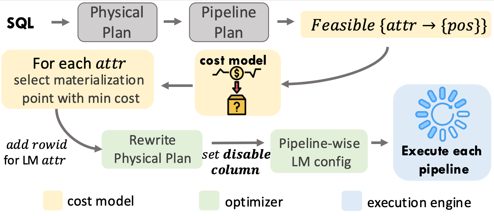

## SLM: Selective Late Materialization in Modern Analytical Databases

**Selective Late Materialization (SLM)** is an intelligent optimization module that automatically customizes materialization plans for queries. 
Given a query plan, SLM determines the optimal materialization point for each attribute based on a cost model. 
Our VLDB 2025 paper "Liu et al. Selective Late Materialization in Modern Analytical Databases", we integrated SLM into DuckDB. 
This repository contains the source code for the work presented in the paper.
The codebase is forked from DuckDB v1.1.0 (commit number: `9af117f0e6d3f2f9ade385dadc46807c1b388dd4`).

## Main modifications of SLM
<p align="center">
  <picture>
    <source media="(prefers-color-scheme: dark)" srcset="./readme/flow_chart.png">
    
  </picture>
</p>
Please refer to the above workflow, our main modifications to the original DuckDB source code involves:

```
LIST
├── ...
├── src     
|   ├── parallel (`pipeline_executor.cpp`)       // add support of          
|   |                                               Materialization before sink. 
│   ├── execution (`physical_plan_generator.cpp`   // enable generating
│   │              and operator/)                     materialization plan.                             
│   └── storage (table/)                      // enable efficient I/O skipping of 
│                                                late materialized attributes.
└── examples/embedded-c++
    ├── figure_scripts                        // all the figure plotting scripts
    ├── microbenchmark
    |   ├── data_generate_scripts/            // microbenchmark data generate scripts
    |   └── *.cpp                             // microbenchmark experiment scripts
    └── job/ & tpcds/                         // public query benchmark experiment scripts
    

```

## Build
We have already included the headers of [emhash](https://github.com/ktprime/emhash) and [nlohmann](https://github.com/nlohmann/json) into the `third_party` directory, thus no dependency installation required.

```
git clone git@github.com:yhliu918/duckdb.git -b latest
cd duckdb
mkdir release && cd release
cmake .. -DCMAKE_BUILD_TYPE=Release
make -j
```


## Microbenchmark
### Data generation
In order to generate all single join data used in the microbenchmark (`Section 5`), please follow the instructions below:
```
cd examples/embedded-c++/microbenchmark/data_generate_scripts
cd unique_hit_key_set && python 32B_key.py
cd .. 
python run_all_generate.py > run_all_generate.sh
bash run_all_generate.sh
```
If you would like generate multi-col data (`Section 5.4`), refer to `microbench_multi_col_data.py`.
For the compressed scenario, please first download data from [SOSD](https://github.com/learnedsystems/SOSD) and [FSST](https://github.com/cwida/fsst/tree/master/paper/dbtext), and place them under `unique_hit_key_set/dbint` or `unique_hit_key_set/dbtext`, then run `microbench_compressed_data.py`.

Notice that the above process automatically generate a database (e.g. `micro.db`) under `data_generate_scripts/unique_hit_key_set`, but you can also change the path by modifying `load_db.py`.

### Run Experiment
The basic command to run early v.s. late materialization experiment:
```
./microbench_build_new <thread_num> 1 <probe_size> <build_size> <selectivity> <payload_size> uniform 1 random random <mat_strat> <queue_thr>
```
- If `mat_strat` = 0, means early materialization. (`queue_thr`= 0)
- If `mat_strat` = 1, means batched late materialization. (`queue_thr` is a hyper-parameter, recommanded value: 100.)
- If `mat_strat` = 2, means naive late materialization. (`queue_thr`= 0)


To reproduce all the microbenchmark results, please run:
```
cd examples/embedded-c++/release
cmake . && make -j
python ../microbenchmark/data_generate_scripts/run_all.py > run_all.sh
bash run_all.sh
```

### Produce the figures from the paper 
Please dump all microbenchmark experiment results into `figure_scripts/origin_data/`, you can run the jupyter notebooks under `figure_scripts` directory to produce all the figures presented in the paper.
If you need our original experiment data (machine information same as `Section 5.1.2`), please click [here]() or concat *yhliu918@gmail.com*.

## System benchmark
Take Join Order Benchmark (JOB) as an example.

### Step 1: download benchmark 
Download the queries from [JOB](git@github.com:gregrahn/join-order-benchmark.git) and csv tables from [imdb](http://event.cwi.nl/da/job/imdb.tgz).
```
cd examples/embedded-c++/job
git clone git@github.com:gregrahn/join-order-benchmark.git
mv join-order-benchmark JOB && cd JOB
wget http://event.cwi.nl/da/job/imdb.tgz
tar -zxvf imdb.tgz 
```

### Step 2: format queries and produce database
First convert csv to parquet, then load tables into a database while adding the rowid column. After that, rewrite queries in specific format (only changing the sql format, without modifying the sql expressions).
```
python csv_to_parquet.py
python add_columnid.py
cd JOB && mkdir parsed && cd ..
python rewrite_query.py
```

### Step 3: run SLM experiments
Get ready for the run!
```
cd examples/embedded-c++/release
# below is fully EM
sync; echo 3 > /proc/sys/vm/drop_caches
./job_script <thread_num> 0 ../job/JOB/parsed/ <query_name> 1 > log
python3 parse_time.py 

# below is selective LM
sync; echo 3 > /proc/sys/vm/drop_caches
./job_script <thread_num> 0 ../job/JOB/parsed/ <query_name> 0 0 _select 1 100 > log
python3 parse_time.py 
```

